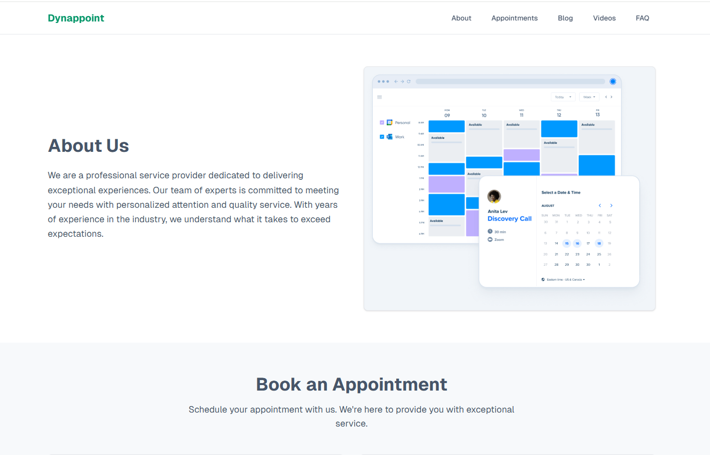
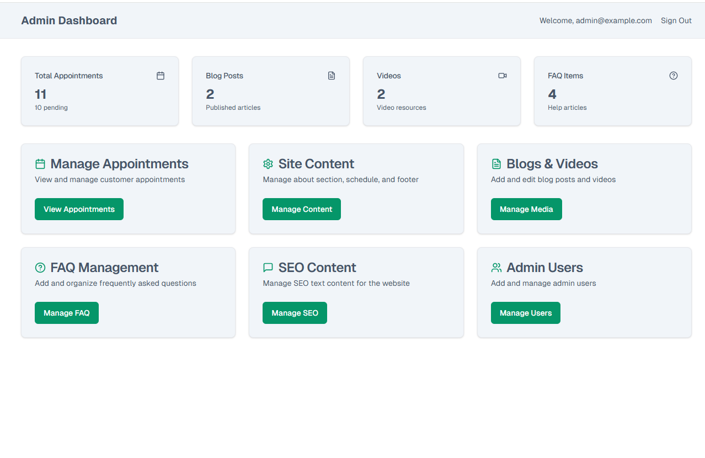
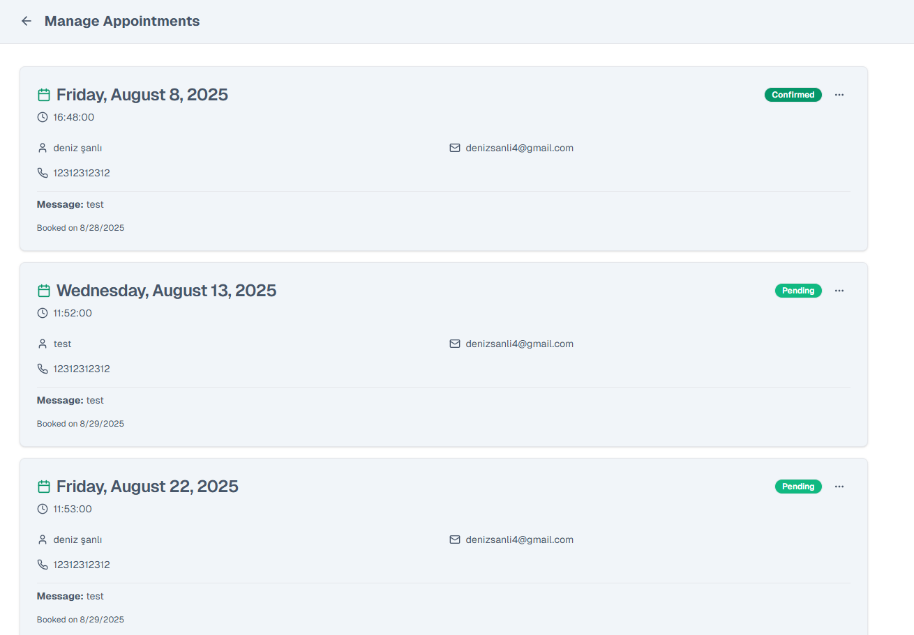
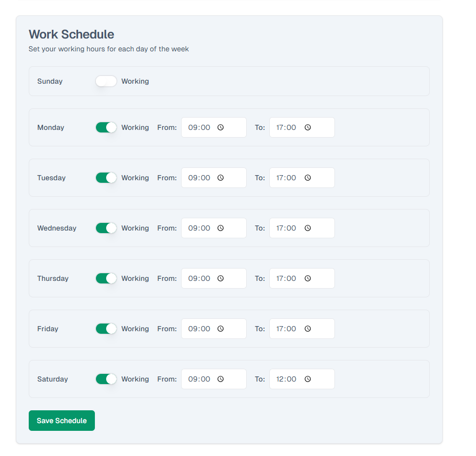
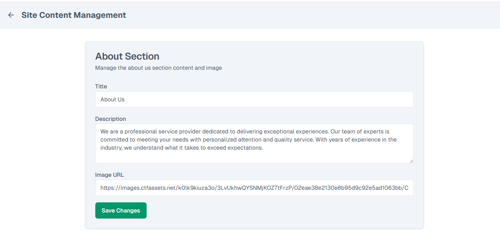
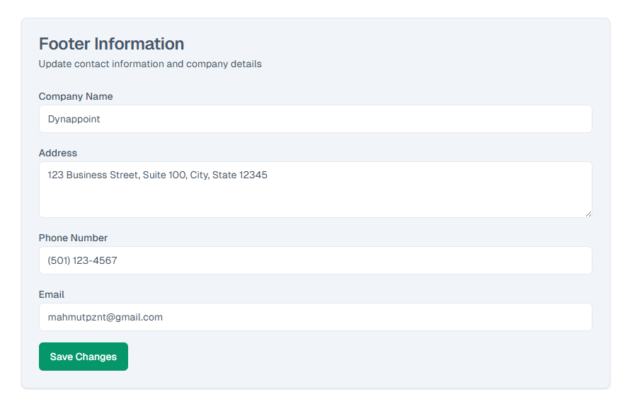
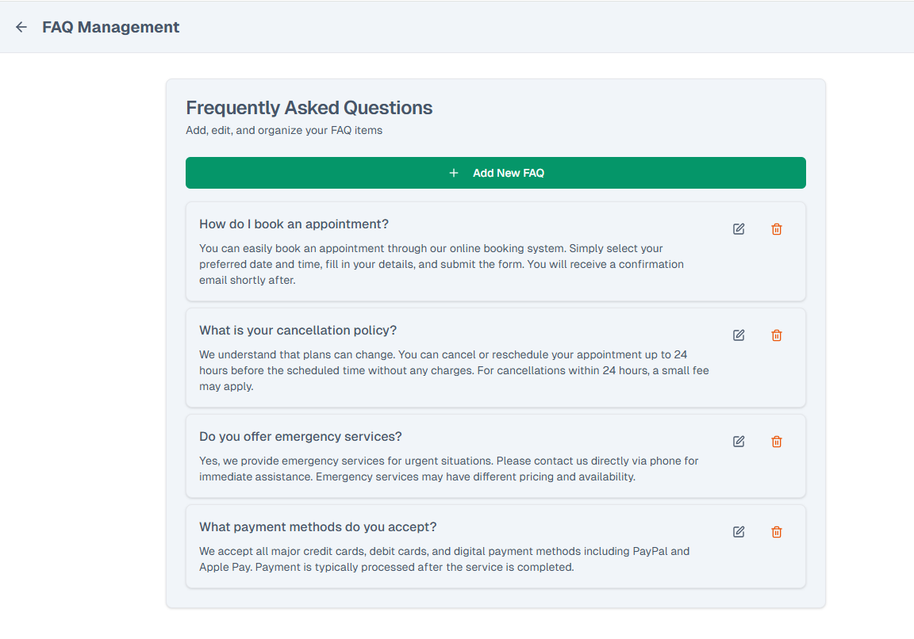
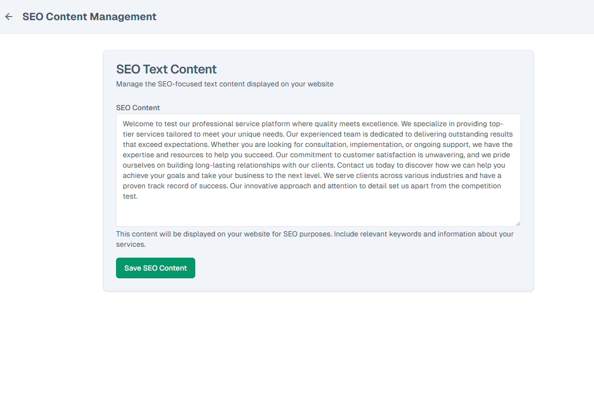

# 📅 Dynappoint

**Dynappoint** is a dynamic, admin-driven appointment platform.  
Designed for flexibility—whether you’re a **dentist**, **course instructor**, or any business using appointment scheduling.

🌐 **Live Demo:** [dynappoint.vercel.app](https://dynappoint.vercel.app)  

---

## ✨ Features

- 🗓️ **Flexible Scheduling** – appointments that adapt to any business type  
- 📝 **Editable Sections** – About, Schedule, Blog, Videos, SEO (all from admin panel)  
- 📊 **Admin Dashboard** – manage everything with ease  
- ⚡ **Modern Tech Stack** – Next.js + React + Tailwind + PostgreSQL + Supabase  
- 📱 **Responsive Design** – works on desktop & mobile  

---

## 🖥️ Tech Stack

- **Frontend:** Next.js, React, Tailwind CSS  
- **Backend & DB:** Supabase, PostgreSQL  

---

## 📸 Screenshots
<p align="center">
  
</p>
<p align="center">
  
   
</p>

<p align="center">
  
    
  
</p>
<p align="center">
  
  
  
</p>

---

## 🚀 Getting Started

```bash
# Clone the repo
git clone https://github.com/DenizS4/Dynappoint.git

# Install dependencies
npm install

# Add your environment variables (Supabase URL & Key)

# Run development server
npm run dev
